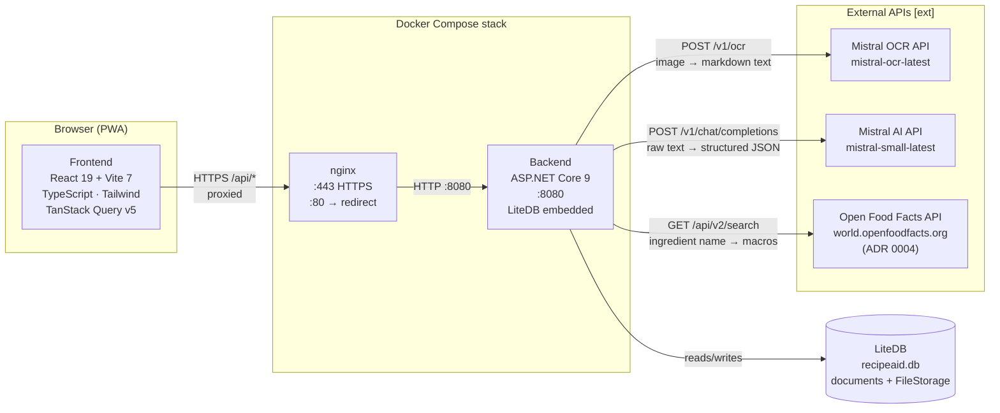

# Architecture Overview — RecipeAId

> **Living document.** Reflects the current deployed system. Update alongside code changes.  
> Generated/updated by the architecture quality agent.

---

## Legend

| Symbol | Meaning |
|--------|---------|
| Solid arrow `-->` | Synchronous call / data flow |
| Dashed arrow `-.->` | Optional / may be absent |
| `[ext]` | External third-party service |

---

## Container / Service Diagram



---

## Dependency Rule

```
Api  ──►  Core  ◄──  Data
```

- **Core** (`RecipeAId.Core`) — zero infrastructure dependencies. All interfaces (`IRecipeService`,
  `IRecipeRepository`, `IOcrService`, `INutritionEstimator`, …) and DTOs live here.
- **Api** (`RecipeAId.Api`) — controllers, HTTP-client adapters (Mistral OCR, Mistral AI,
  Open Food Facts), middleware, DI wiring.
- **Data** (`RecipeAId.Data`) — LiteDB repository implementations.

---

## Primary Request Flow — Recipe Detail with Nutrition (Current)

```mermaid
sequenceDiagram
    actor User
    participant FE as Frontend<br/>(React)
    participant NGINX as nginx
    participant CTRL as RecipesController<br/>(Api)
    participant RDS as RecipeDetailService<br/>(Core)
    participant RS as RecipeService<br/>(Core)
    participant REPO as RecipeRepository<br/>(Data / LiteDB)
    participant NE as OpenFoodFactsEstimator<br/>(Api)
    participant CACHE as IMemoryCache<br/>(in-process)
    participant OFF as Open Food Facts<br/>[ext]

    User->>FE: Open recipe detail page
    FE->>NGINX: GET /api/v1/recipes/{id}
    NGINX->>CTRL: HTTP :8080

    CTRL->>RDS: GetEnrichedByIdAsync(id)

    RDS->>RS: GetByIdAsync(id)
    RS->>REPO: GetByIdAsync(id)
    REPO-->>RS: Recipe entity
    RS-->>RDS: RecipeDto (NutritionSummary = null)

    RDS->>NE: EstimateAsync(ingredients)
    loop Each ingredient (parallel, max 4 concurrent)
        NE->>CACHE: get(ingredientName)
        alt Cache hit
            CACHE-->>NE: NutritionData
        else Cache miss
            NE->>OFF: GET /api/v2/search?q={name}&page_size=1
            OFF-->>NE: JSON product + nutriments
            NE->>CACHE: set(ingredientName, NutritionData, 1h)
        end
    end
    NE-->>RDS: NutritionSummaryDto (or null if all failed)

    RDS-->>CTRL: RecipeDto with NutritionSummary
    CTRL-->>NGINX: 200 OK { recipe + nutritionSummary }
    NGINX-->>FE: JSON response
    FE-->>User: Render ingredients + macro panel
```

---

## Primary Request Flow — OCR Recipe Import (Current)

```mermaid
sequenceDiagram
    actor User
    participant FE as Frontend<br/>(React)
    participant CTRL as RecipesController<br/>(Api)
    participant OCR as MistralOcrService<br/>(Api)
    participant SAN as OcrTextSanitizer<br/>(Core)
    participant PAR as OcrParserService<br/>(Core)
    participant LLM as PublicLlmIngredientParserService<br/>(Api)
    participant SSE as OcrSessionStore<br/>(in-memory)
    participant MISTRAL_OCR as Mistral OCR API<br/>[ext]
    participant MISTRAL_AI as Mistral AI API<br/>[ext]

    User->>FE: Take photo / upload image
    FE->>CTRL: POST /api/v1/recipes/from-image

    CTRL->>OCR: ExtractTextAsync(imageStream)
    OCR->>MISTRAL_OCR: POST /v1/ocr (base64 image)
    MISTRAL_OCR-->>OCR: markdown text
    OCR-->>CTRL: OcrResult(rawText)

    CTRL->>SAN: Sanitize(rawText)
    SAN-->>CTRL: sanitizedText

    CTRL->>PAR: Parse(sanitizedText)
    PAR-->>CTRL: OcrDraft (regex-extracted)

    CTRL-->>FE: 200 { draft + sessionId } (immediate)

    Note over CTRL,LLM: LLM refinement runs in background Task
    CTRL->>LLM: ParseAsync(sanitizedText) [background]
    LLM->>MISTRAL_AI: POST /v1/chat/completions
    MISTRAL_AI-->>LLM: structured ingredient JSON
    LLM-->>SSE: Complete(sessionId, result)

    FE->>CTRL: GET /api/v1/ocr-sessions/{id}/events (SSE)
    SSE-->>FE: event: done { ingredients }
    FE-->>User: Show refined ingredient list
```

---

## Key Architectural Decisions

| ADR | Decision | Status |
|-----|----------|--------|
| [ADR 0001](adr/0001-switch-sqlite-to-litedb.md) | Replace SQLite + EF Core with LiteDB; ingredients embedded in recipe documents | Accepted |
| [ADR 0002](adr/0002-replace-ingredient-parser-sidecar-with-public-llm-api.md) | Replace Ministral 3B Ollama sidecar with Mistral AI public API | Accepted |
| [ADR 0003](adr/0003-replace-ocr-sidecar-with-mistral-ocr-and-add-post-ocr-sanitization-boundary.md) | Replace PaddleOCR sidecar with Mistral OCR; add post-OCR sanitization boundary | Accepted |
| [ADR 0004](adr/0004-nutrition-estimation-via-open-food-facts.md) | Nutrition estimation via Open Food Facts public API; `INutritionEstimator` in Core, HTTP impl in Api | Accepted |
